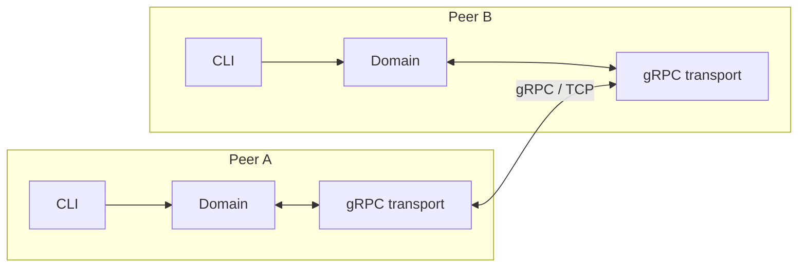
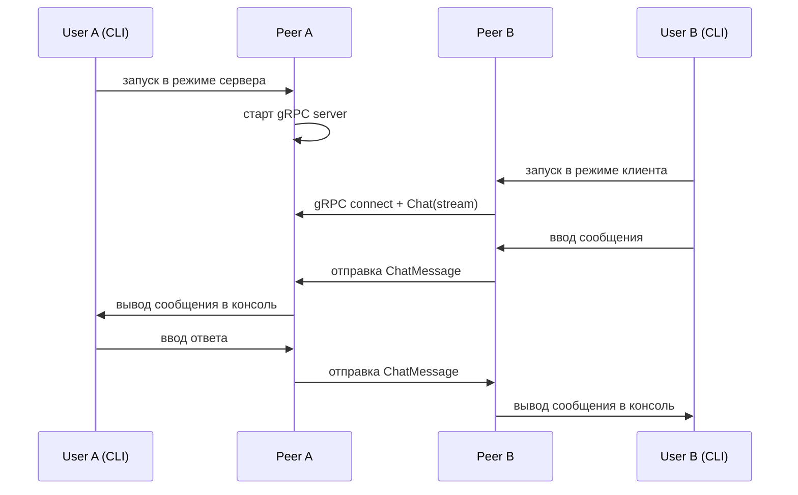
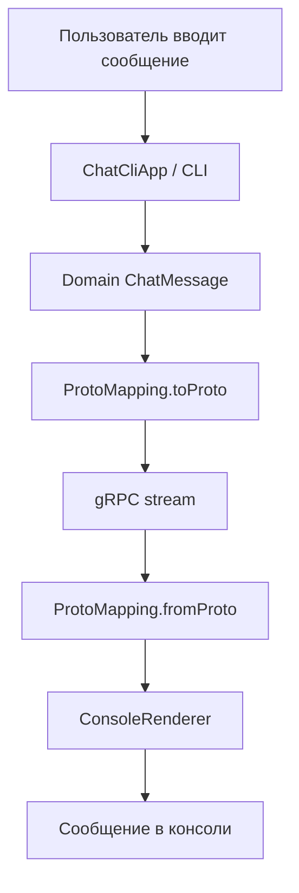
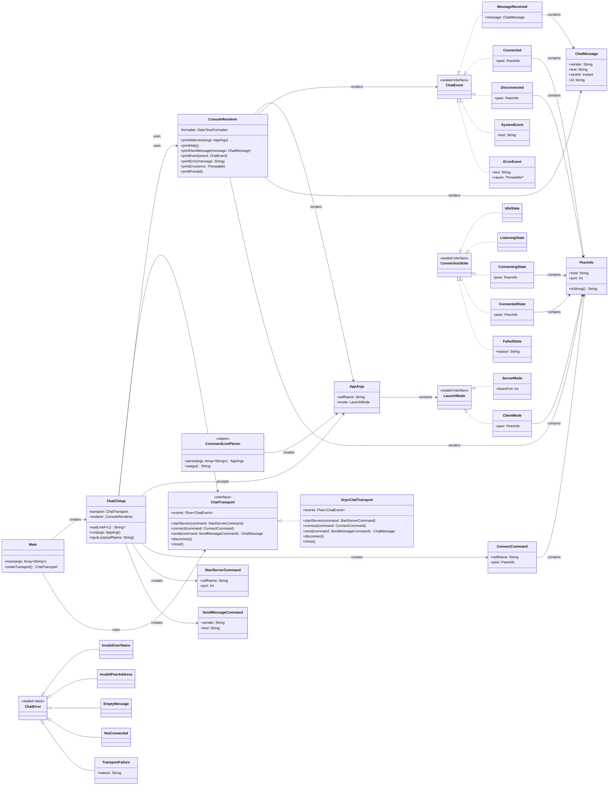

# Архитектура

## Назначение системы

Проект представляет собой консольный **peer-to-peer чат на Kotlin/JVM**.  
Два процесса устанавливают **прямое сетевое соединение**: один peer запускается в режиме ожидания входящего подключения, второй — подключается к нему по адресу и порту. После установки соединения стороны обмениваются сообщениями в дуплексном режиме.

Транспорт реализован через **gRPC**, а сетевой контракт описан в **Protocol Buffers**.

## Декомпозиция задач между участниками команды

В таблице: **+** — зона в основном на этом участнике; **—** — не вёл; в **docs** / **other** — кратко что именно.

| Участник | ci | grpc | cli | domain | docs | other |
|----------|:--:|:----:|:---:|:------:|:----:|-------|
| **Павел Корт** ([`pppppptttttt`](https://github.com/pppppptttttt)) | + | — | + | + | `Требования`, `Архитектура`, диаграммы | Gradle/Kotlin init |
| **Павел Усатов** ([`UsatovPavel`](https://github.com/UsatovPavel)) | — | + | — | — | init, `testPlan` | `chat-api`, `Main.kt`, е2е тесты |

`grpc` здесь: модуль `chat-api` и пакет `grpc/*` (клиент, сервер, транспорт, interceptor). Точка входа и склейка слоёв — из merge-веток CLI + gRPC.

## Структура репозитория

```text
ExtremeProgrammingPP/
├── .github/workflows/ci.yml
├── chat-api/                     # protobuf/gRPC контракт и кодогенерация
├── docs/                         # требования и архитектурное описание
├── src/main/kotlin/
│   ├── cli/                      # CLI, разбор аргументов, вывод в консоль
│   ├── domain/                   # доменная модель, команды, порты, ошибки
│   ├── grpc/                     # транспортный слой на gRPC
│   └── Main.kt                   # точка входа приложения
├── src/test/kotlin/              # unit + integration tests
├── build.gradle.kts
├── settings.gradle.kts
└── README.md
```

## Архитектурные уровни

Система разбита на три основных уровня:

1. **CLI-уровень**

    * разбор аргументов запуска;
    * управление жизненным циклом консольного приложения;
    * отображение сообщений и ошибок пользователю.

2. **Доменный уровень**

    * модель сообщения;
    * модель peer-а;
    * события чата;
    * команды запуска/подключения/отправки;
    * транспортный порт `ChatTransport`.

3. **Транспортный уровень**

    * gRPC client/server;
    * преобразование между domain-моделью и protobuf;
    * поддержка bidirectional streaming;
    * обработка соединения, отключения и сетевых ошибок.

---

## Диаграмма компонентов



## Модуль `chat-api`

Модуль `chat-api` содержит описание protobuf-контракта и отвечает за генерацию Java/gRPC классов, которые затем используются из Kotlin-кода основного приложения.

### Контракт

Файл: `chat-api/src/main/proto/org/hse/chat/v1/chat.proto`

```proto
syntax = "proto3";

package org.hse.chat.v1;

option java_multiple_files = true;
option java_package = "org.hse.chat.v1";
option java_outer_classname = "ChatProto";

import "google/protobuf/timestamp.proto";

message ChatMessage {
  string sender = 1;
  string text = 2;
  google.protobuf.Timestamp sent_at = 3;
}

service ChatService {
  rpc Chat(stream ChatMessage) returns (stream ChatMessage);
}
```

### Назначение контракта

* `sender` — имя отправителя;
* `text` — текст сообщения;
* `sent_at` — момент отправки в UTC;
* `Chat` — двусторонний поток сообщений между двумя peer-ами.

Выбор **bidirectional streaming** естественен для чата: после установления соединения обе стороны одновременно отправляют и принимают сообщения без открытия отдельного RPC на каждую строку.

## Основные пакеты приложения

### `cli`

Пакет отвечает за пользовательский интерфейс:

* `AppArgs.kt` — модель аргументов запуска;
* `CommandLineParser.kt` — разбор CLI-аргументов;
* `ConsoleRenderer.kt` — форматирование вывода;
* `ChatCliApp.kt` — orchestration CLI-приложения.

### `domain`

Пакет описывает бизнес-модель приложения и её границы:

* `model/ChatMessage.kt` — доменная модель сообщения;
* `model/PeerInfo.kt` — информация о peer-е;
* `model/ChatEvent.kt` — события чата;
* `model/ConnectionState.kt` — состояние соединения;
* `command/*` — команды запуска и взаимодействия;
* `port/ChatTransport.kt` — интерфейс транспортного слоя;
* `error/ChatError.kt` — ошибки домена.

### `grpc`

Пакет реализует сетевой слой:

* `client/ChatGrpcClient.kt` — исходящее подключение;
* `server/ChatGrpcServer.kt` — серверный режим ожидания;
* `transport/GrpcChatTransport.kt` — реализация `ChatTransport`;
* `transport/ChatTransportGrpcService.kt` — адаптер между transport и gRPC service;
* `transport/ProtoMapping.kt` — преобразование domain ↔ protobuf;
* `interceptor/*` — извлечение/проброс сетевого контекста peer-а.

## Логическая схема взаимодействия



## Ключевые решения

### 1. Multi-module Gradle

Используется отдельный модуль `chat-api`, чтобы:

* отделить сетевой контракт от прикладной логики;
* централизованно настраивать protobuf/gRPC codegen;
* переиспользовать контракт независимо от CLI-части.

### 2. Явная доменная модель

CLI и остальной код приложения не должны работать напрямую с protobuf-классами.
Для этого используется собственная domain-модель и слой маппинга (`ProtoMapping`).

### 3. Транспорт через порт

`ChatTransport` задаёт абстракцию для сетевого обмена. Это позволяет:

* изолировать gRPC внутри адаптера;
* тестировать доменную и CLI-логику независимо от сети;
* при необходимости заменить транспорт без изменения остального кода.

## Поток данных



## Диаграмма классов

