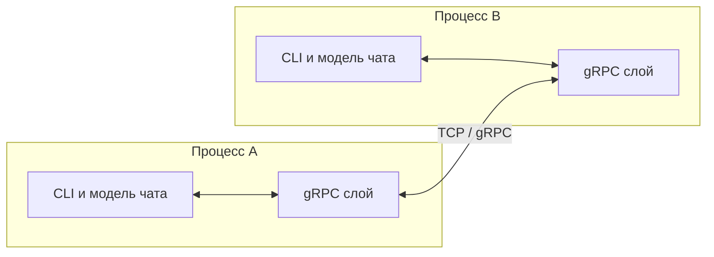
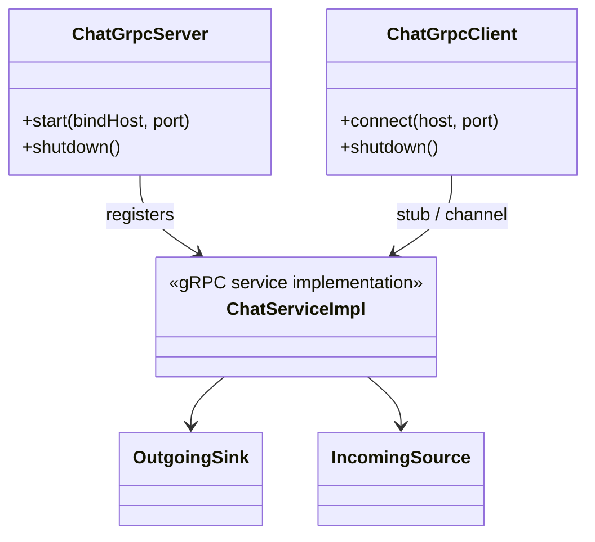

# Архитектура

## Контекст системы

P2P-чат на Kotlin: два процесса устанавливают прямое TCP-соединение, поверх него — **gRPC** с контрактом в **Protocol Buffers**. Один процесс в режиме ожидания слушает порт, второй подключается по адресу и порту. После рукопожатия оба обмениваются сообщениями чата.

Разделение между участниками команды: **транспорт и контракт (gRPC)** — автор настоящего раздела; **консольный интерфейс и доменная модель чата** — второй участник (ниже только границы ответственности).

## Диаграмма компонентов

Связь **CLI ↔ gRPC** внутри процесса — через согласованный контракт на уровне Kotlin (интерфейсы адаптера), чтобы UI не зависел от сгенерированных stub-классов напрямую.

---

## Усатов: gRPC, Protocol Buffers и сетевой слой

### Зона ответственности

- Описание и сопровождение **`.proto`**: сервисы, сообщения, при необходимости — пакет и версия API.
- **Генерация** Kotlin/Java кода из proto (Gradle-плагин), публикация артефакта модуля контракта (например `:proto` или `:chat-api`).
- Реализация **gRPC Server** (режим «жду подключения») и **gRPC Client** (исходящее подключение к peer): настройка канала, `ManagedChannel`, `Server`, порты, shutdown.
- Выбор паттерна RPC для дуплекса: типично **bidirectional streaming** (`StreamObserver`) для непрерывного обмена сообщениями чата; альтернатива — согласованный набор unary-вызовов (фиксируется в `.proto` и README).
- **Сериализация** полей сообщения: отправитель, текст, метка времени (и при необходимости идентификатор сессии); согласование с доменной моделью на границе адаптера.
- Обработка жизненного цикла соединения: ошибки сети, отмена, корректное закрытие канала и сервера.
- **Логирование** на уровне транспорта (подключение, отключение, ошибки gRPC).
- **Тесты**: модульные тесты адаптеров; при возможности — интеграционный тест «in-process» или `grpc-java` testing utilities для проверки контракта.

### Граница с моделью чата и CLI

gRPC-слой предоставляет второму участнику узкий API вида:

- установить соединение (клиент / сервер);
- передать исходящие сообщения в поток (или очередь), принять входящие и отдать вверх по стеку;
- уведомить о разрыве.

Доменные сущности «сообщение в чате» могут отличаться от `protobuf`-типов; преобразование выполняется в **mapper** на стороне gRPC-модуля или в тонком адаптере по соглашению с напарником.

### Диаграмма классов (gRPC-модуль, логическая)

Названия ориентировочные; фактические имена — по репозиторию.

- **ChatGrpcServer** — поднимает `Server`, биндит порт, регистрирует сервис из `.proto`.
- **ChatGrpcClient** — создаёт канал к peer, получает async stub для streaming.
- **ChatServiceImpl** — реализация сгенерированного интерфейса сервиса: маршрутизация потоков `StreamObserver`.
- **OutgoingSink / IncomingSource** — абстракции для передачи данных в CLI/модель (например, `Channel`, callback-интерфейс или Kotlin Flow — по выбору команды).

### Обоснование выбора технологий (транспорт)

| Решение | Зачем |
|--------|--------|
| **gRPC** | Контракт в proto, кодогенерация клиента/сервера, типобезопасность, привычный стек для JVM-бэкенда. |
| **Protocol Buffers** | Явная схема сообщений, эволюция API при согласовании версий. |
| **Bidirectional streaming** | Естественная модель для чата: оба направления без постоянного открытия новых RPC на каждую строку (при согласовании с напарником). |
| **Kotlin + Gradle** | Единый язык команды; protobuf/grpc плагины в одной сборке. |

---

## Павел Корт: только область работы

- **Консольный UI**: разбор аргументов запуска (имя пользователя, режим клиента с host/port или режим сервера с локальным портом), цикл ввода-вывода, форматирование вывода (имя, дата/время, текст).
- **Модель чата**: представление сообщения и сессии на стороне приложения, при необходимости — очередь исходящих и доставка входящих в UI.
- **Сборка**: совместно с gRPC-слоем — единая точка входа приложения и сценарии из README; детальная внутренняя структура классов CLI и модели остаётся на усмотрение напарника.

Детальные диаграммы компонентов и классов для этой части в настоящий документ **не входят** (по договорённости в команде).

## Декомпозиция задач (кратко)

| Участник | Основные задачи |
|----------|------------------|
| gRPC (автор) | `.proto`, Gradle codegen, server/client, streaming, ошибки и shutdown, тесты контракта/транспорта, согласование API с моделью |
| CLI + модель | Аргументы, консоль, отображение, доменные типы, связь с адаптером gRPC |

При изменении `.proto` ответственный за gRPC инициирует согласование и обновление зависимого кода.
